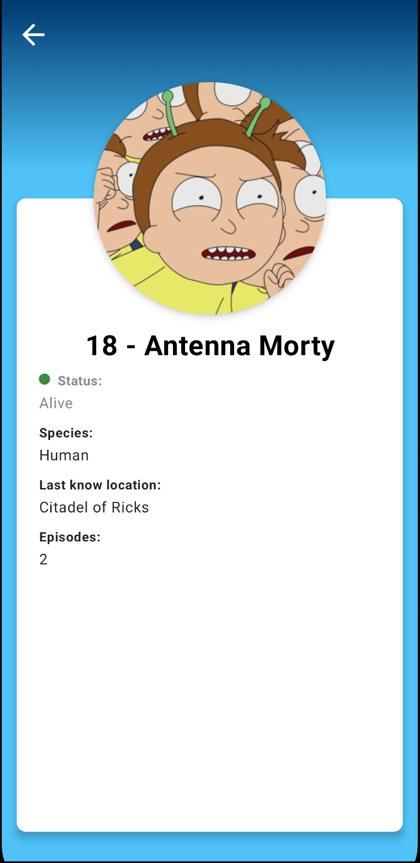

# Rick and Morty Character List Application

## Описание
Приложение представляет собой список персонажей из сериала "Рик и Морти". С помощью данного приложения можно просматривать список персонажей, искать их и переходить к детальной информации о каждом персонаже.

## Функциональность
- Просмотр списка персонажей.
- Поиск персонажей.
- Переход к карточке каждого персонажа для просмотра детальной информации.
- Экран ошибки с использованием Lottie анимации.
- Поддержка релиза в Google Play Store.

## Используемые технологии
- Полный Compose
- Многомодульная архитектура
- Retrofit для сетевых запросов
- Hilt для внедрения зависимостей
- Coil для загрузки изображений
- Навигация Jetpack Compose
- Тестирование с использованием JUnit и MockK

## Архитектура проекта
Проект разделен на несколько модулей для лучшей структуризации кода и обеспечения масштабируемости:
- `app` - основной модуль приложения.
- `core` - содержит общие компоненты, такие как утилиты, расширения, сетевые запросы, темы.
- `features` - содержит модули для каждой функциональной области приложения: `error`, `main`, `personDetail`, `personList`.

## Список зависимостей
Основные зависимости проекта включают:
- **Compose**: `androidx.compose.ui:ui`, `androidx.compose.material3:material3`, `androidx.navigation:navigation-compose`, и другие.
- **Hilt**: `com.google.dagger:hilt-android`, `androidx.hilt:hilt-navigation-compose`.
- **Retrofit**: `com.squareup.retrofit2:retrofit`, `com.squareup.retrofit2:converter-gson`, `com.squareup.okhttp3:logging-interceptor`.
- **Coil**: `io.coil-kt:coil-compose`.
- **Lottie**: `com.airbnb.android:lottie`, `com.airbnb.android:lottie-compose`.
- **Testing**: `junit:junit`, `io.mockk:mockk`, `androidx.test:core`, `androidx.test.ext:junit`, `androidx.test.espresso:espresso-core`.

Полный список зависимостей и их версии можно найти в файле `gradle/libs.versions.toml`.

## Скриншоты

## Лицензия
Этот проект лицензирован под MIT License - подробности см. в файле `LICENSE`.# RAM
# RAM
# RAM
# RAM
